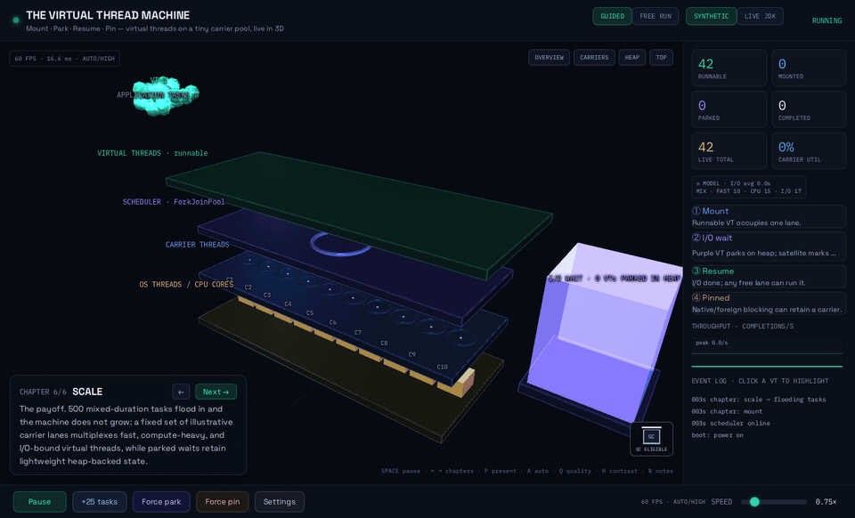

# The Virtual Thread Machine

A native Java 25 and JavaFX 3D visualization of how virtual threads mount,
park, resume, and pin across a small carrier pool. The implementation follows
[`design/JavaFX-Spec.md`](design/JavaFX-Spec.md) and uses the accompanying HTML
simulation as its behavioral reference.



## Run

Requirements: JDK 25 and Maven 3.9+.

```bash
mvn javafx:run
```

The application opens at 1440×900. It automatically advances from BOOT to
MOUNT after three simulated seconds.

Use the `SYNTHETIC` feed for a completely deterministic teaching run, or select
`LIVE JDK` to drive the visualization with tasks executing on a real
`Executors.newVirtualThreadPerTaskExecutor()`. In live mode, mount/park/resume
events come from the workload and JFR observes `jdk.VirtualThreadPinned` events.
The four carrier lanes remain illustrative because Java intentionally does not
expose ordinary virtual-thread carrier identity.

## Controls

- `Space`: pause/resume the live simulation or play/pause recorded history
- `←` / `→`: previous or next chapter
- `1`–`4`: overview, carriers, heap, and top camera presets
- `0`: emergency overview camera
- `P`: presenter mode (full screen with distraction-free HUD)
- `A`: auto-advance chapters every 11 seconds
- `R`: replay the current chapter
- `Q`: cycle automatic, high, and low render quality
- `H`: toggle high-contrast mode
- `N`: toggle the second-screen speaker-notes window
- `J` / `K`: step backward or forward through recorded history
- `L`: leave replay and return to the untouched live simulation
- `F11`: toggle full screen
- Mouse drag: orbit
- Mouse wheel/trackpad scroll or two-finger pinch: zoom in and out
- Drag the bottom timeline or focus it and use `←` / `→`: inspect an earlier
  immutable frame; colored marks identify chapters, mounts, parks, pins,
  completions, failures, and cancellations
- Click a VT or one of its event-log entries: follow its lifecycle and time in
  each state
- `Esc` or the lifecycle card's × button: stop following a VT
- HUD controls: switch synthetic/live feeds, add 25 tasks, force a park or
  demonstration pin, change speed, or restart with new demo settings

The sidebar includes live total, carrier utilization, average I/O, event-log
highlighting, and a rolling completions/second chart. `AUTO` render quality
hides nonessential glows when frame rate drops or the task pool becomes dense.
The layout compacts below 1280 px and all controls expose keyboard focus and
accessible descriptions.

At the top of the machine, animated code cards pass through the application
task inlet before becoming runnable virtual threads. At the bottom, each OS/CPU
core is a toothed processor gear: it rotates and brightens while its carrier
executes, eases up to speed and coasts smoothly to rest, and becomes a red
warning stutter while pinned.

The rolling timeline retains the latest 360 display snapshots. Entering history
automatically pauses the live model, updates the 3D particles, counters, event
log, narration, lifecycle card, and speaker notes to the selected instant, and
never restores historical data into the model. `LIVE`/`L` returns to the exact
live state and running/auto-play mode that existed before scrubbing.

Tasks deliberately have different profiles and seeded random durations: short
CPU work, longer compute work, and I/O-bound work with randomized 1–8 second
waits. I/O-bound VTs carry a small purple satellite before blocking. When they
park, a stack-chunk marker moves from the released carrier into the heap while
an animated connection continues to an external network, disk, timer, or
database endpoint. The parked VT keeps the same sphere identity and size inside
an open heap basket, with its retained stack shown as a small plate beneath it.
The continuation returns through the run queue before mounting on any available
carrier.

Clicking a VT opens a live lifecycle strip for `RUNNABLE`, `MOUNTED`, `PARKED`,
and `TERMINATED` durations. The PARK and PINNED chapters compare carrier release
with carrier retention directly, while a pressure bar expands and contracts
with the scheduler run queue. Completed VTs release their carrier, turn white,
and dissolve in place.

Four advanced chapters turn the machine into a performance lab:

- `PLATFORM vs VT` runs the same blocking workload as one-platform-thread-per-task
  and as virtual threads on a fixed carrier pool.
- `POOL LIMIT` places a three-permit database connection pool downstream; excess
  VTs visibly park without consuming carriers. In `LIVE JDK` mode the permits
  are enforced by a fair `Semaphore`, so the wait is performed by real VTs.
- `CPU BOUND` saturates the carriers with compute-only tasks and plots the
  throughput plateau at the carrier/core count.
- `STRUCTURED` groups child VTs under parent scopes, shows joins, and contains a
  child failure by cancelling only its active siblings.

## Reproducible settings

Command-line settings use `--name=value` syntax:

```bash
mvn javafx:run -Djavafx.args="--carriers=4 --max-threads=500 --task-rate=1.4 --seed=42"
```

Supported settings:

- `--carriers=2..10`
- `--max-threads=50..800`
- `--task-rate=0.3..6.0`
- `--seed=<long>`
- `--live` (use real JDK virtual-thread tasks)
- `--presenter` (start in presenter/full-screen mode)

For visual smoke tests, `--snapshot=/path/image.ppm` writes a full-window PPM
after 4.5 seconds. Override the delay with `--snapshot-at=<seconds>`.
Use `--snapshot-chapter=1..10` to capture a specific chapter. The helper script
`scripts/capture-chapters.sh` captures all ten with seed 42. Add
`--snapshot-follow` to include the selected hero VT's lifecycle card in a
visual smoke test. Add `--snapshot-replay` to capture the historical replay UI
roughly two seconds behind the live edge.

## Test

```bash
mvn test
```

The model is JavaFX-free and uses a seeded `RandomGenerator`. The application
feeds it fixed 60 Hz simulation steps so a seed produces repeatable behavior
independently of render-frame timing.

The suite also exercises randomized state invariants, immutable bounded replay
history and markers, deterministic event vocabulary, the real virtual-thread
bridge, settings parsing, and a scale performance budget.

## Native package

Build a self-contained platform app image with JDK 25's `jpackage`:

```bash
scripts/package.sh
# or: mvn clean package -Pnative-image
```

The result is under `target/dist`. On macOS, set
`VT_MACHINE_SIGN_IDENTITY` before packaging to codesign with the hardened
runtime. After configuring an `xcrun notarytool` keychain profile, set
`VT_MACHINE_NOTARY_PROFILE` and run `scripts/notarize-macos.sh` to submit,
staple, and validate the bundle.

## Java 25 accuracy note

Since JDK 24, blocking in ordinary `synchronized` code no longer pins a virtual
thread. The remaining pinning case demonstrated here is blocking while a native
or foreign-function frame prevents unmounting. Virtual-thread stack chunks live
on the heap; the 3D carrier lanes are a teaching abstraction, particularly in
the live feed.
